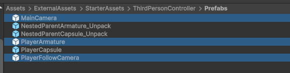
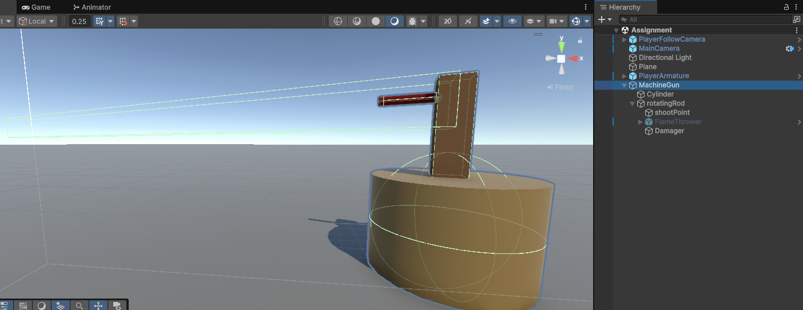
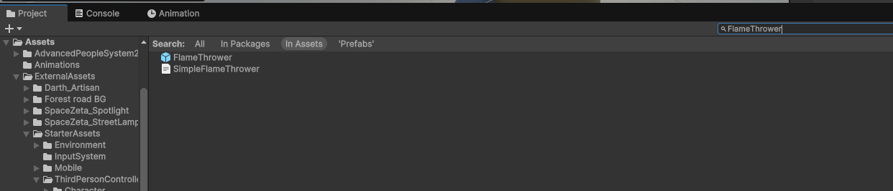

# Assignment Burn the player.

Your Task is to Create A New Scene! 

Import Your Third Person Controller. from the starter kit as we know that we should Import following objects into our scene.

- MainCamera
- PlayerArmature
- PlayerFollowCamera




Once You Setup Scene. Let's Create Your Machine Gun.

I have created my machine gun which looks like this. if you see in the image. there is a red point stuff which indicate machine facing direction. as we have discuss before when we create a model we follow the real world axis (x,y,z) dimension to create the perfect shape. in this example object facing point is in Z forward. so when we rotate the object towards player it always show the facing side to the player.



I am using Unity Particle Assets [Click Here](https://assetstore.unity.com/packages/vfx/particles/particle-pack-127325) Import these asset into your project.

and you can search for FlameThrower in the Assets Search To Use This Particle.



from the script to show these visuals you can just enable and disable this object.

You need to complete these three scripts, add functionality in the game. and you pass the assignment.

- PlayerHealth
- MachineGun
- Damager


First Let's See The Machine Gun Script
```csharp

public class MachineGun : MonoBehaviour
{
    // fameFlower effect we enable to show the fire. when we shoot the target.
    [SerializeField] private GameObject flameFlowerEffect;

    // rotatingRod is the rod which will rotate to aim the target.
    [SerializeField] private Transform rotatingRod;

    // rotateSpeed is the speed at which the gun will rotate.
    [SerializeField] private float rotateSpeed = 10f;

    // range is the distance from the gun to the target.
    [SerializeField] private float range = 5f;

    // target is the object which we want to shoot.
    [SerializeField] private Transform target;

    private PlayerHealth _playerHealth;


    private void Update()
    {
        // if our target is null then return from the function. because we don't want to execute it further.
        if (target == null) return;

        // check if the player is not dead.
        if (_playerHealth == null)
        {
            // get the _playerHealth component and store it into _playerHealth variable.
        }

        // if the player is dead then return from the function. because we don't want to execute it further.
        if (_playerHealth.IsDead)
        {
            // disable the flamethrower effect here.
            return;
        }

        // we check the distance between the target and the gun. if the distance is less than the range then we shoot the target.
        if (Vector3.Distance(transform.position, target.position) <= range)
        {
            // calculate the direction of the target from the gun.

            // get the look Quaternion LookRotation from the direction.

            // calculate the rotation speed per frame smoothly

            // set the rotation only at y-Axis. so the gun will rotate only at y-Axis.

            // enable the flameFlowerEffect to show the fire.
        }
        else
        {
            // if the distance is greater than the range then disable the flameFlowerEffect.
        }
    }
}
```

### Help Here
**How To Calculate the direction?**

To Calculate the direction we subtract target position with our object position
as we know our Transform position is Vector3 Data Type.
```c#
Vector3 direction = target.position - transform.position;
```

**Getting Angle to Look At the object**
to get the rotation Quaternion has it's method `LookRotation` which we can use to get the angle at which we can rotate our player to face the direction.

```c#
// we calculated the direction 
Vector3 direction = target.position - transform.position;

// here we pass our direction into Quaternion.LookRotation(direction) to get the angle.
Quaternion lookRotation = Quaternion.LookRotation(direction);
```

in our lookRotation we have the exact values X, Y, Z for the rotation. we can rotate our object in an angle we want to rotate. you can check in the inspector. try and rotate your object on X then Y then Z try one by one and see which shows the accurate rotation.

in our example we want to rotate our rod on y-axis right? so we can do 
```c#
rotatingRod.rotation = Quaternion.Euler(0f, lookRotation.y, 0)
```
you can see we are just giving Y Axis to our object to rotate towards the target. 

when we give this rotation axis it will instantly rotate the object. 
but we want to rotate it smoothly. frame by frame. so what we can do in our update loop

we can calculate a smooth speed.
we will use Quaternion.Lerp method to get the smooth rotation value
we will pass our object current rotation in first parameter and in 2nd parameter we will pass the lookRotation value at which we want our object to rotate. 
then in third parameter we will pass our rotation speed. in final we will get Vector3 value using .eulerAngles
```c#
Vector3 rotation = Quaternion.Lerp(rotationRod.rotation, lookRotation, Time.deltaTime * rotateSpeed).eulerAngles;
```

your final code to calculate the direction and rotate towards the target
```csharp
Vector3 direction = target.position - transform.position;

Quaternion lookRotation = Quaternion.LookRotation(direction);

Vector3 rotation = Quaternion.Lerp(rotatingRod.rotation, lookRotation, Time.deltaTime * rotateSpeed).eulerAngles;

rotatingRod.rotation = Quaternion.Euler(0f, rotation.y, 0f);
```


our second class Damager. to use this script
create an empty object then add collider make it isTrigger true and Attach our Damager Class Component.

```c#
public class Damager : MonoBehaviour
{
    public float damage = 10f;


    private void OnTriggerStay(Collider other)
    {
        // if the other object has the health component then we damage the other object.

        // get the PlayerHealth Component script and call method which you have created in the script to give the player damage.
    }
}
```

PlayerHealth script

```c#

public class PlayerHealth : MonoBehaviour
{
    [SerializeField] private ThirdPersonController playerController;
    [SerializeField] private float health = 100f;

    public bool IsDead => health <= 0;


    private void Start()
    {
        // player start with full health. and controls should be enabled
    }


    public void TakeDamage(float damage)
    {
        // subtract the health with damage

        // check if health is less then or equal to 0 disable the player controls and Debug.Log message that Player is Dead.
    }
}

```

Summaries

- Create a New Scene.
- Import Third Person Assets
- Create Your Machine Gun Shape
- Import the particles effects and use FlameThrower.
- Complete The Scripts by writing the missing code.

Submission

Record Video and Post it into Group.