# Benefits of Learning From Me.
## I will build you by teaching you following and as you grow you have each of these skills in your pocket to start your freelancing career.
### Level Designer.
### Game Programmer.
### Story Teller.
### Non Player Controller (NPC).
### Game Designer.
### Multiplayer
---
---
---
---
---
---
---
---

<!-- # Course Content

## [Introduction](#introduction-1)

## [Chapter 1: Introduction to Game Engine and Unity Engine](#chapter-1)
- Game Engines—What Are They?
- The Unity Game Engine
- Installation and Configuration of UNITY (LTS and Support Systems)
- Introduction of Cross-Platform in Unity

## [Chapter 2: The Script Editor: Visual Studio Code](#chapter-2)
- Navigating the Unity Interface
    - Inspector
    - Scene Window
    - Game Window
    - Hierarchy
    - Project Setting Window
- Importing of Assets in UNITY
    - Brief Discussion on Extensions that Unity Supports
    - How Unity Changes Them into .asset Files
- Essential Unity Concepts
    - Game Objects and Components
    - Prefabs
    - Tags
    - Layers
    - Camera
- Creating Scene
    - The Hierarchy and Parent-Child Relationships

## Chapter 3: C# Scripting
- Scripts as Behaviors Components
- Awake and Start
- Update and Fixed Update
- Enabling and Disabling Components
- Activating Game Objects
- Translate and Rotate
- Look At
- Linear Interpolation
- Destroy
- GetButton and GetKey
- GetAxis
- OnMouseDown
- GetComponent
- Delta Time
- Instantiate
- Invoke

## Chapter 4: Advanced C# Scripting
- Statics
- Generics
- Extension Methods
- Lists and Dictionaries
- Coroutines
- Quaternions
- Delegates
- Attributes
- Events
- Scriptable Objects

## Chapter 5: Canvas System - UI
1. UI Canvas
2. UI RectTransform
3. UI Button
4. UI Image
5. UI Text
6. UI Events and Event Triggers
7. UI Slider

## Chapter 6: Physics
1. Colliders
2. Colliders as Triggers
3. Rigidbodies
4. Adding Physics Forces
5. Adding Physics Torque
6. Physics Materials
7. Physics Joints
8. Detecting Collisions with OnCollisionEnter
9. Raycasting

## Chapter 7: Animations
- The Animation View
- Animation Properties
- Animation Curves and Events
- The Animator Component
- The Animator Controller
- Animator Controller Layers
- Animator Scripting
- Blend Trees
- Animator Sub-state Machine Hierarchies

## Chapter 8: Ragdoll and Inverse Kinematics
- Apply IK on Humanoid Characters

## [Chapter 9: Lighting and Rendering](#chapter-9-lights)
- Lighting Overview
- Lights (All Types of Lights)
- Using Skyboxes
- The Standard Shader
- Materials
- Textures
- A Gentle Introduction to Shaders

## Chapter 10: Audio Setup
- Audio Listeners
- Audio Sources
- Optimized Way of Calling Sound in Game

## Chapter 11: Navigation Basics
1. Navigation Overview
2. NavMesh Baking
3. The NavMesh Agent
4. Off-mesh Links
5. NavMesh Obstacles

## Chapter 12: Systems Basics
- Particle System
- Event System
- Line Renderer
- Sprite Renderer
- Trail Renderer
- Editor Settings
- Build Settings
- Player Settings
- Scoring Systems using Pref Class, Scriptable Objects, JSON File

## Chapter 13: Third Party Plugins/Essential Packages
- Unity Standard Assets
- Stats and Profilers
- DOTweens
- Import Packages through UPM
- CineMachine

## Project
- Submit Project Proposal
- Start Work on It After Approval (Show Progress While Working)
- Project Submission

--- -->
<!-- My Introduction -->

# Introduction

MySelf Syed Suleman Shah Graduated as Software Engineer From University of Sindh Jamshoro.

I have been doing Freelance since end of 2020. I Have worked on small to large application. in game development Mobile, PC, VR And WebGL also as backend Programmer I have developed Rest Apis, Multiplayer Game Servers. and so on.

I have Earn Positive Reputation On Fiverr as well as on Upwork
 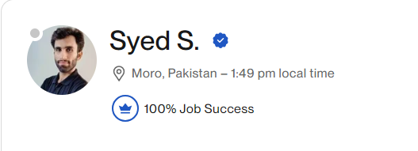 

And I am here to share my experience with you! and teach you **Mobile Game Development!**
```markdown
---------------------------------------------------------------------------
|                                                                         |
|                    **Let's Begin Your Journey**                         |
|                                                                         |
---------------------------------------------------------------------------
```

<!-- Chapter 1 Here Definitions -->
---
# Class 1
## Basics of the Game Engine.
### What is a Game Engine?
A **game engine** is a software framework designed to simplify and streamline the game development process. It provides developers with a suite of tools and features to create video games, handling various aspects such as graphics, physics, audio, artificial intelligence (AI), and user input¹².

### Key Components of a Game Engine:
1. **Graphics Engine**: Renders 2D or 3D visuals, textures, and animations.
2. **Physics Engine**: Simulates real-world physics, including collisions and gravity.
3. **Audio Engine**: Manages sound effects, music, and voiceovers.
4. **AI System**: Controls non-player characters (NPCs) and their behaviors.
5. **Input Management**: Handles user inputs from devices like keyboards, mice, and controllers¹².

### Ex Unity Game Engine?
**Unity** 
- Unity is one of the most popular game engines.
- It Supports Both 3D Games and as well as 2D Game Development.
- Unity Provide All the Necessary tools to Develop a Game. Such as
  - Unity Input System
  - Unity Canvas for UI and UX
  - Unity Has AI Agents 
  - Unity Support Multiple Rendering Solutions, Built In, Universal Renderer(URP), and High Definition Render Pipeline (HDRP).
  - Unity Create and Support Animations Clips and Control them with a Animator Controller.
  - Unity Provide An Amazing Physics Components Which Helps us to add realistic physics in the game.
    - example Colliders and RigidBody.
- Apart from All these amazing features Unity also provides [Services](https://cloud.unity.com/) To Monetize Your Game, Add Multiplayer, Create Lobbies, Cloud Data Storage, Vivox Voice Chat and Dedicate Server Hosting.
- Unity Support Cross-platform Deployment. Which Means Once You can Build Your Application on different Platforms such as Mobile, WebGL, VR and Desktop PC. by only doing slight dependencies changes. 

----

**[Download](https://unity.com/download) The Unity Hub**

Unity Hub is an Application provide by Unity To Handle Unity Installation of different versions and it also Manage Your Projects. It has built in Templates for different Platforms it also provide learning content.

Install any latest LTS (Long Term Supported) Version From Your Unity Hub. and make sure to check Android Dependencies To Include Them. as our focus will be on developing a Unity Mobile App.

------------------------------------------------
## Getting Started with Unity Editor
Let's Understand The Basics of Unity Editor!

First We Have Project Window
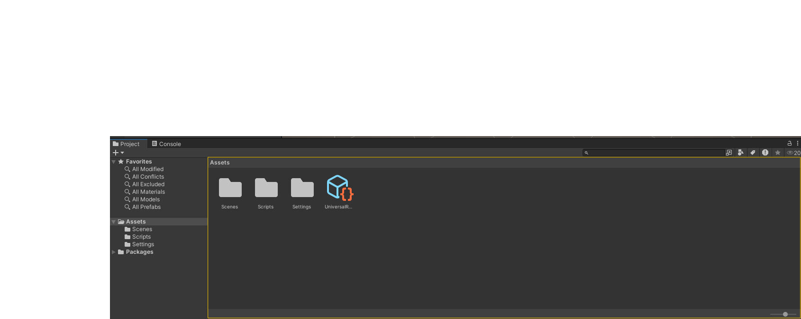

Assets are our games files such as images, sound effects, our character sprites, animations clips, our c# scripts files. we import our files into our asset folders. and we can organize them. as we want like all the sound effects in audio folder, or all the c# scripts in our Script Folder.

Here are some Unity Facts

* when we import any of our asset unity create .meta file of our each asset file and in our meta file. it has some a unique id and import settings. and where we can see all those settings?

Select Any File and check our the **inspector window**
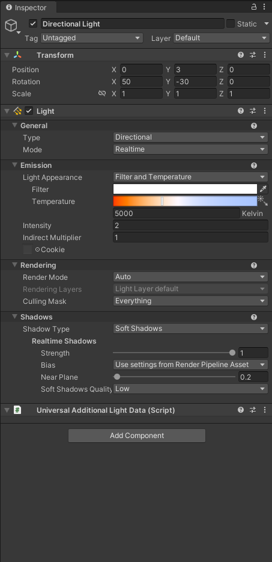

any of our assets file or our game object. when we select it. the inspector shows all the Components and properties of that file. for the files we can see different settings and for the game objects we can see different components.

Now as we progress we will get use to it. but for now let's understand and if you want to see the settings we select the file and it shows the settings in the inspector window.


## Now Let's Understand the Scene.

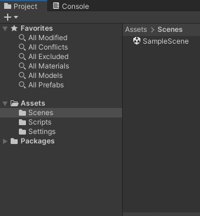


Unity Scene is a place where we put all the stuff together our assets files, and create some cools game objects, design our game environment. it's like preparing a stage. let's take an example. you want to prepare an concert stage for your favorite singer to perform. but the twist is there are some haters who want to destroy the stage which you built so hard for an event. but we are going to create our Hero Cop! who will save the concert by arresting those haters who try to ruined the event of our favorite singer. Oh Wow! we just create a game story.

so we will gather all our game files. create our scene. now back to the topic. we know that we place all stuff together in our scene to prepare an stage right. but How we do it?


### Unity Hierarchy
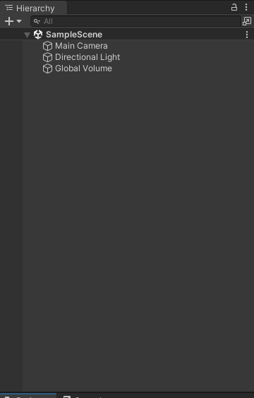

Here we place all of our objects. our concert models, lights, and all the stuff. to prepare our stage.

we will cover following topics by creating the our game scene.

- Game Objects and Components
  - a game object can have multiple components and it can be identified by tag and name. it also has a layer
- Transform
  - Transform is a common component in every single game object which handles position, rotation and scaling.
- Child and Parent Positions
  -  we place an object inside another object to make it's children and when child local position base 0 is equal to parent position so when we move the parent child move with it and also rotate, scale according to the parent transform attributes.
- Pivot Point
  - in 2D or 3D game object pivot position is where the object start from.
    - learn to create door to understand it better!
- Prefabs
  - if we want to create similar objects in multiple places. we create object object then create prefab of that object. we drag our gameobject from our scene and darg it into asset folder. we can create a prefabs folder and place our folder in it. so we can use that prefab instead of creating another object when we need it.
- Tags
  - We Assign the Tages to Identify an Object From our Scripts in Runtime.
- Layers
  - we group different object by assiging it layers.
    - layers can be used to identify rendering
      - 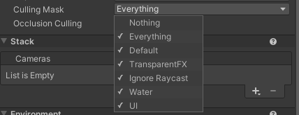
    - layers can be used for our physics interaction that this object interact with this or not.
      - 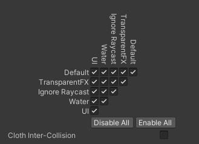
- Camera
  - Camera is our players eyes from he sees our game environment.
  - Unity Camera has some special features to render only what it sees. here is the list
    - Camera Projection
      - There is 2 type of projection Perspective and Orthographic
        - Perspective is used mostly in 3D games it memic our human eye to see the world as we get away from an object it get's looks more distance.
        - Orthographic is like you are looking at a blueprint of a house map
          - 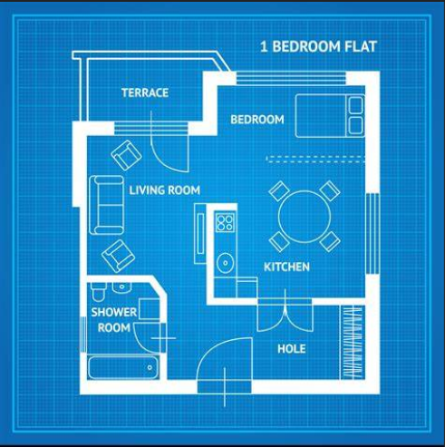
          - this perspective is mostly used in 2D games.
    - Camera Rendering
      - Important once for now are
        - Post Processing
          - these are the effects which are applied to camera before it render the image to the screen.
            - we can set global effect mean to all over our world
            - we can set effects for specific areas.
            - and this checkbox in the camera tell it to apply these effects or not.
            - 
        - Occlusion Culling
          - Object which are not under camera perspective should not render.
        - Culling Mask
          - We Select the Layers Here which we want our camera to render.
      - Leave the other Settings At Default You Will Understand them as you progress in your learning.
## Creating Scene
We Will Be Building A Simple Concert Stage Scene! Let's Learn To Import this Asset From Unity Asset Store.

### [Click Me](https://assetstore.unity.com/packages/3d/props/interior/spotlight-and-structure-141453) To Download an asset we will be using to create our scene.

our aim is to understand unity hierarchy and create a simple game scene.

Here are the Actors we are going to use. you will find them in your course material.

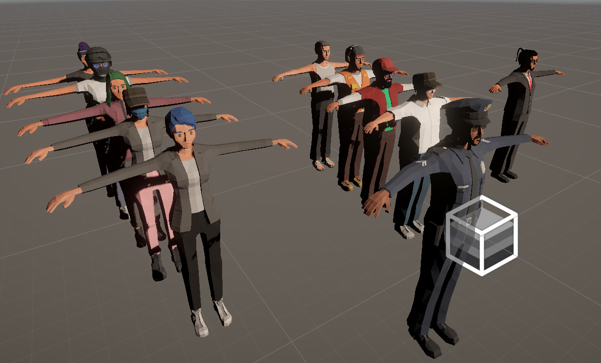

-----
# Class 2 
## Everything About Lights

To Make our scene visually appealing Unity Lights Play Fantastic Role, there is a lot of settings but if we cover the most important ones you can be able to create unity scene with fantastic lights. 
by understanding about in unity creating scene and lights. stuff also with the optimization techniques. I have already made you level designer. you have the knowledge to create awesome looking 3D scene and light them. now it's all up to your creativity how you use this knowledge.

Lightning in Unity have 3 Modes
- Realtime Lighting
  - Description: Realtime lights are calculated and updated every frame during gameplay.
  - Use Case: Ideal for dynamic scenes where lights or objects move frequently.
  - Performance: More demanding on the GPU and CPU since calculations are done continuously.
  - Example: A flashlight in a game that the player can move around.
- Baked Lighting
  - Description: Baked lights are pre-calculated and stored in lightmaps before the game runs.
  - Use Case: Best for static scenes where lights and objects do not move.
  - Performance: Less demanding during gameplay as the lighting is precomputed.
  - Example: Sunlight in an outdoor scene where the environment remains static.
- Mixed Lighting
  - Description: Combines elements of both realtime and baked lighting. Direct lighting is calculated in real-time, while indirect lighting is precomputed.
  - Use Case: Suitable for scenes with a mix of static and dynamic elements.
  - Performance: More demanding than baked lighting but less so than fully realtime lighting.
  - Example: A streetlight that casts dynamic shadows on moving characters but has static indirect lighting on the environment.

Now this was about the light settings related. 

Now let's understand what types of Objects we have in the Unity Editor for our game scene.
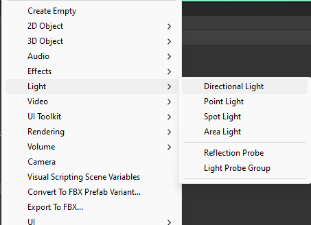

let's understand these lights and how they work in our scene
- Directional Light
  - Description: Simulates light from a distant source, like the sun. The light rays are parallel and affect all objects in the scene equally, regardless of their distance from the light.
  - Use Case: Ideal for outdoor scenes where you need consistent lighting across a large area.
  - Example: Sunlight in an open-world game.
- Point Light
  - Description: Emits light in all directions from a single point, similar to a light bulb. The intensity of the light diminishes with distance.
  - Use Case: Best for localized light sources like lamps or torches.
  - Example: A streetlamp illuminating a small area around it.
- Spot Light
  - Description: Emits light in a cone shape from a single point. The light intensity decreases with distance and the angle of the cone can be adjusted.
  - Use Case: Useful for focused light sources like flashlights or stage lights.
  - Example: A flashlight that the player can move around.
- Area Light
  - Description: Emits light from a rectangular or disc-shaped area. The light is distributed evenly across the surface of the area light but only from one side.
  - Use Case: Suitable for large, soft light sources like windows or large overhead lights. Note that area lights are only available in baked lighting mode in Unity’s built-in render pipeline.
  - Example: A large window casting soft light into a room.


Now Let's understand more about Light Component
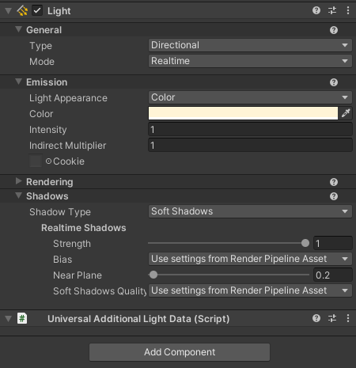

We Understand what is in the general Type and Mode which we have discus above.

Now Focus On Emission Property
- we have Light Appearance
  - which have 2 types, colors, and filter & Temperatur
  - basically what it does it manupilate the color of your light. 
  - just picture you have a green bulbs all around your room and they are emmiting the green light. that's what the appearance type do. and below in the color property you can set your desired color.
- Intensity
  - Controls the Brightness of the light. Higher value makes the light brighter, while lower value dim it.
- Indirect Multiplayer
  - Adjust the intensity of the light that bounces off the surfaces
- What is Indirect Light?
  - Indirect Value is the strength of the light to bounces off an object or surface higher the value stronger the bounce will be.
- Cookie is an texture effect we can assign to a light. to make it smooth, sharp or in some pattern.

-----
# Class 4
## Intro Of Unity Game Components with examples
## Components
- Components are building Blocks that defines the behavior and appearance of an GameObjects.
- Each GameObject can have multiple components attach to it, to achieve the desired functionality
- in sort everything you see when you select a game object and you see in the inspector, you will find all the components of that specific game object.

**Here is the list of common components**
- **Transform**
  - Transform is fundamental to every GameObject. it defines the object position, rotation and scale in 3D word space.
  - You Can Not Remove the Transform Component from a game object.
  - It helps you to move the object rotate it and scale it.
- **Mesh Filter**
  - In This Component We Assign a 3D Mesh Object.
- **Mesh Renderer**
  - This Components Draw the Mesh From Mesh Filter Component.
  - It gives appearance using materials.
  - We Can Set Light Impact In Settings.
  - and other settings.
- **Collider**
  - Collider Defines Physical Shape of the 3D Object for physical interactions.
  - Common Components Names
    - Box Collider
    - Capsule Collider
    - Sphere Collider
    - Mesh Collider
  - It can detect collision and trigger events.
- **RigidBody**
  - Rigidbody components enables GameObject to act under the physics engine.
  - When You add this components gravity force applied to it.
  - It also enables the collider to triggers events such as triggers and collision.
- **Camera and light**
  - these are also components we have already covered in the previous sections.
  
- **Audio Source**
  - It Plays the Audio Clips in the scene.
  - this component has 2D and 3D settings to play the sound in specific area or global.
  - volume to adjust volume.
  - range to define the min and max range.
  - and other filters.
- **Animator**
  - Animation component controls the animations for a Game Object.
  - It Manages States, and transitions, layers allowing for complex animation sequence 
  - example door opening and closing.
  - a 3d human type character walking, running and jumping.
- **UI Components**
  - We Have multiple UI Components Main is Canvas inside Canvas we set all of our UI setup. like buttons, text and image etc.
- **Scripts**
  - We can write our own custom components with C#
  - with custom script we can also modify the other components properties.
  - some examples
    - writing a player movement scripts
    - a script to control the animator parameters
    - a script to send event triggers and
  - we can create any kind of script for our game object to achieve desire behavior.


<!-- # Chapter 4: Advanced C# Scripting -->

<!-- # Chapter 5: Canvas System - UI -->

<!-- # Chapter 6: Physics -->

<!-- # Chapter 7: Animations and Animator -->

<!-- # Chapter 8: Ragdoll and Inverse Kinematics -->

<!-- # Chapter 10: Audio Setup -->

<!-- # Chapter 11: Navigation Basics -->

<!-- # Chapter 12: Systems Basics -->

<!-- # Chapter 13: Third Party Plugins/Essential Packages -->


----
----
----
# Class Summaries

## class summary 27-09-2024 Friday

In Class we learned about unity editor Scene and created a scene 
while creating the scene we understand 

- Prefabs
- How To Look as an Object perspective while desiging.
- How we identify Object X,Y,Z
- Global and Local Locations
- Pivot Point and Center Point
- Keeping Propotion and accurate space between objects while designing. using snap grid tool in unity
- Mesh Filter Component
  - we learned that it render the 3D mesh of an object
- Mesh Renderer
  - we learned that it is used. how it appears and act in our scene. does lights shadows can be cast on light? and Materials to add in this component for mesh visual presentation.

After Class I have designed an complete Level Here [Click Me](https://youtu.be/VM36TQJrkqw) Just by following it up you can clear your concepts More!


---
## class summary on 30/9/2024 Monday
- we understood what are the light mode and we see the example
- we studied all type of light objects in Directional, Spot, Point and we see their examples as well. we understood the light component
- we understood how we bake the light.
- we see the example of mix, bake and realtime lights
- we created a small scene revise the previous section.


## Class summary on 2/10/2024 Wednesday
- practical work.