# Benefits of Learning From Me.
## I will build you by teaching you following and as you grow you have each of these skills in your pocket to start your freelancing career.
### Level Designer.
### Game Programmer.
### Story Teller.
### Non Player Controller (NPC).
### Game Designer.
### Multiplayer
---
---
# Classes
- [Basics Of Game Development And Unity](#class-1-basics-of-the-game-engine)
- [Everything about lightning.](#class-2-everything-about-lights)
- [Unity Game Components and there overview](#class-4-intro-of-unity-game-components-with-examples)
- [Custom Component MonoBheavior Cycle and Time Settings](#class-5th-monday-7th-of-october-unity-c-custom-component-workflow-and-time-settings)
- [programming structure and fundamentals](#class-6th-programming-fundamentals-understanding-structure-and-integrating-third-person-start-kit-with-practical-work)
---
# [Summaries](#class-summaries)
---

# Guide Related Performing Task
[](https://www.youtube.com/watch?v=W3oqmlT_fMk)

# Tasks: By Working on the following tasks. You Will be Android Developer In No Time.
  - [Task 1: Implement Third Person StartKit](#task-1-import-the-starter-kit-third-person-controller)
  - [Task 2: Ball Inside Box](#task-2-ball-inside-box)
  - [Task 3: Coin Picker](#task-3-coin-picker-game)
  - [Task 4: Animate Coin](#task-4-animate-our-coin-in-our-coin-maker)
  - [Task 5: Build Your First Apk](#task-5-deploy-game-into-your-phone)

---
---
---
---

<!-- # Course Content

## [Introduction](#introduction-1)

## [Chapter 1: Introduction to Game Engine and Unity Engine](#chapter-1)
- Game Engines—What Are They?
- The Unity Game Engine
- Installation and Configuration of UNITY (LTS and Support Systems)
- Introduction of Cross-Platform in Unity

## [Chapter 2: The Script Editor: Visual Studio Code](#chapter-2)
- Navigating the Unity Interface
    - Inspector
    - Scene Window
    - Game Window
    - Hierarchy
    - Project Setting Window
- Importing of Assets in UNITY
    - Brief Discussion on Extensions that Unity Supports
    - How Unity Changes Them into .asset Files
- Essential Unity Concepts
    - Game Objects and Components
    - Prefabs
    - Tags
    - Layers
    - Camera
- Creating Scene
    - The Hierarchy and Parent-Child Relationships

## Chapter 3: C# Scripting
- Scripts as Behaviors Components
- Awake and Start
- Update and Fixed Update
- Enabling and Disabling Components
- Activating Game Objects
- Translate and Rotate
- Look At
- Linear Interpolation
- Destroy
- GetButton and GetKey
- GetAxis
- OnMouseDown
- GetComponent
- Delta Time
- Instantiate
- Invoke

## Chapter 4: Advanced C# Scripting
- Statics
- Generics
- Extension Methods
- Lists and Dictionaries
- Coroutines
- Quaternions
- Delegates
- Attributes
- Events
- Scriptable Objects

## Chapter 5: Canvas System - UI
1. UI Canvas
2. UI RectTransform
3. UI Button
4. UI Image
5. UI Text
6. UI Events and Event Triggers
7. UI Slider

## Chapter 6: Physics
1. Colliders
2. Colliders as Triggers
3. Rigidbodies
4. Adding Physics Forces
5. Adding Physics Torque
6. Physics Materials
7. Physics Joints
8. Detecting Collisions with OnCollisionEnter
9. Raycasting

## Chapter 7: Animations
- The Animation View
- Animation Properties
- Animation Curves and Events
- The Animator Component
- The Animator Controller
- Animator Controller Layers
- Animator Scripting
- Blend Trees
- Animator Sub-state Machine Hierarchies

## Chapter 8: Ragdoll and Inverse Kinematics
- Apply IK on Humanoid Characters

## [Chapter 9: Lighting and Rendering](#chapter-9-lights)
- Lighting Overview
- Lights (All Types of Lights)
- Using Skyboxes
- The Standard Shader
- Materials
- Textures
- A Gentle Introduction to Shaders

## Chapter 10: Audio Setup
- Audio Listeners
- Audio Sources
- Optimized Way of Calling Sound in Game

## Chapter 11: Navigation Basics
1. Navigation Overview
2. NavMesh Baking
3. The NavMesh Agent
4. Off-mesh Links
5. NavMesh Obstacles

## Chapter 12: Systems Basics
- Particle System
- Event System
- Line Renderer
- Sprite Renderer
- Trail Renderer
- Editor Settings
- Build Settings
- Player Settings
- Scoring Systems using Pref Class, Scriptable Objects, JSON File

## Chapter 13: Third Party Plugins/Essential Packages
- Unity Standard Assets
- Stats and Profilers
- DOTweens
- Import Packages through UPM
- CineMachine

## Project
- Submit Project Proposal
- Start Work on It After Approval (Show Progress While Working)
- Project Submission

--- -->
<!-- My Introduction -->

# Introduction
MySelf Syed Suleman Shah Graduated as Software Engineer From University of Sindh Jamshoro.

I have been doing Freelance since end of 2020. I Have worked on small to large application. in game development Mobile, PC, VR And WebGL also as backend Programmer I have developed Rest Apis, Multiplayer Game Servers. and so on.

I have Earn Positive Reputation On Fiverr as well as on Upwork
  

And I am here to share my experience with you! and teach you **Mobile Game Development!**
```markdown
---------------------------------------------------------------------------
|                                                                         |
|                    **Let's Begin Your Journey**                         |
|                                                                         |
---------------------------------------------------------------------------
```

<!-- Chapter 1 Here Definitions -->
---
# Class 1 Basics of the Game Engine.
### What is a Game Engine?
A **game engine** is a software framework designed to simplify and streamline the game development process. It provides developers with a suite of tools and features to create video games, handling various aspects such as graphics, physics, audio, artificial intelligence (AI), and user input¹².

### Key Components of a Game Engine:
1. **Graphics Engine**: Renders 2D or 3D visuals, textures, and animations.
2. **Physics Engine**: Simulates real-world physics, including collisions and gravity.
3. **Audio Engine**: Manages sound effects, music, and voiceovers.
4. **AI System**: Controls non-player characters (NPCs) and their behaviors.
5. **Input Management**: Handles user inputs from devices like keyboards, mice, and controllers¹².

### Ex Unity Game Engine?
**Unity** 
- Unity is one of the most popular game engines.
- It Supports Both 3D Games and as well as 2D Game Development.
- Unity Provide All the Necessary tools to Develop a Game. Such as
  - Unity Input System
  - Unity Canvas for UI and UX
  - Unity Has AI Agents 
  - Unity Support Multiple Rendering Solutions, Built In, Universal Renderer(URP), and High Definition Render Pipeline (HDRP).
  - Unity Create and Support Animations Clips and Control them with a Animator Controller.
  - Unity Provide An Amazing Physics Components Which Helps us to add realistic physics in the game.
    - example Colliders and RigidBody.
- Apart from All these amazing features Unity also provides [Services](https://cloud.unity.com/) To Monetize Your Game, Add Multiplayer, Create Lobbies, Cloud Data Storage, Vivox Voice Chat and Dedicate Server Hosting.
- Unity Support Cross-platform Deployment. Which Means Once You can Build Your Application on different Platforms such as Mobile, WebGL, VR and Desktop PC. by only doing slight dependencies changes. 

----

**[Download](https://unity.com/download) The Unity Hub**

Unity Hub is an Application provide by Unity To Handle Unity Installation of different versions and it also Manage Your Projects. It has built in Templates for different Platforms it also provide learning content.

Install any latest LTS (Long Term Supported) Version From Your Unity Hub. and make sure to check Android Dependencies To Include Them. as our focus will be on developing a Unity Mobile App.

------------------------------------------------
## Getting Started with Unity Editor
Let's Understand The Basics of Unity Editor!

First We Have Project Window


Assets are our games files such as images, sound effects, our character sprites, animations clips, our c# scripts files. we import our files into our asset folders. and we can organize them. as we want like all the sound effects in audio folder, or all the c# scripts in our Script Folder.

Here are some Unity Facts

* when we import any of our asset unity create .meta file of our each asset file and in our meta file. it has some a unique id and import settings. and where we can see all those settings?

Select Any File and check our the **inspector window**


any of our assets file or our game object. when we select it. the inspector shows all the Components and properties of that file. for the files we can see different settings and for the game objects we can see different components.

Now as we progress we will get use to it. but for now let's understand and if you want to see the settings we select the file and it shows the settings in the inspector window.


## Now Let's Understand the Scene.


Unity Scene is a place where we put all the stuff together our assets files, and create some cools game objects, design our game environment. it's like preparing a stage. let's take an example. you want to prepare an concert stage for your favorite singer to perform. but the twist is there are some haters who want to destroy the stage which you built so hard for an event. but we are going to create our Hero Cop! who will save the concert by arresting those haters who try to ruined the event of our favorite singer. Oh Wow! we just create a game story.

so we will gather all our game files. create our scene. now back to the topic. we know that we place all stuff together in our scene to prepare an stage right. but How we do it?


### Unity Hierarchy


Here we place all of our objects. our concert models, lights, and all the stuff. to prepare our stage.

we will cover following topics by creating the our game scene.

- Game Objects and Components
  - a game object can have multiple components and it can be identified by tag and name. it also has a layer
- Transform
  - Transform is a common component in every single game object which handles position, rotation and scaling.
- Child and Parent Positions
  -  we place an object inside another object to make it's children and when child local position base 0 is equal to parent position so when we move the parent child move with it and also rotate, scale according to the parent transform attributes.
- Pivot Point
  - in 2D or 3D game object pivot position is where the object start from.
    - learn to create door to understand it better!
- Prefabs
  - if we want to create similar objects in multiple places. we create object object then create prefab of that object. we drag our gameobject from our scene and darg it into asset folder. we can create a prefabs folder and place our folder in it. so we can use that prefab instead of creating another object when we need it.
- Tags
  - We Assign the Tages to Identify an Object From our Scripts in Runtime.
- Layers
  - we group different object by assiging it layers.
    - layers can be used to identify rendering
      - 
    - layers can be used for our physics interaction that this object interact with this or not.
      - 
- Camera
  - Camera is our players eyes from he sees our game environment.
  - Unity Camera has some special features to render only what it sees. here is the list
    - Camera Projection
      - There is 2 type of projection Perspective and Orthographic
        - Perspective is used mostly in 3D games it memic our human eye to see the world as we get away from an object it get's looks more distance.
        - Orthographic is like you are looking at a blueprint of a house map
          - 
          - this perspective is mostly used in 2D games.
    - Camera Rendering
      - Important once for now are
        - Post Processing
          - these are the effects which are applied to camera before it render the image to the screen.
            - we can set global effect mean to all over our world
            - we can set effects for specific areas.
            - and this checkbox in the camera tell it to apply these effects or not.
            - 
        - Occlusion Culling
          - Object which are not under camera perspective should not render.
        - Culling Mask
          - We Select the Layers Here which we want our camera to render.
      - Leave the other Settings At Default You Will Understand them as you progress in your learning.
## Creating Scene
We Will Be Building A Simple Concert Stage Scene! Let's Learn To Import this Asset From Unity Asset Store.

### [Click Me](https://assetstore.unity.com/packages/3d/props/interior/spotlight-and-structure-141453) To Download an asset we will be using to create our scene.

our aim is to understand unity hierarchy and create a simple game scene.

Here are the Actors we are going to use. you will find them in your course material.


-----
# Class 2 Everything About Lights

To Make our scene visually appealing Unity Lights Play Fantastic Role, there is a lot of settings but if we cover the most important ones you can be able to create unity scene with fantastic lights. 
by understanding about in unity creating scene and lights. stuff also with the optimization techniques. I have already made you level designer. you have the knowledge to create awesome looking 3D scene and light them. now it's all up to your creativity how you use this knowledge.

Lightning in Unity have 3 Modes
- Realtime Lighting
  - Description: Realtime lights are calculated and updated every frame during gameplay.
  - Use Case: Ideal for dynamic scenes where lights or objects move frequently.
  - Performance: More demanding on the GPU and CPU since calculations are done continuously.
  - Example: A flashlight in a game that the player can move around.
- Baked Lighting
  - Description: Baked lights are pre-calculated and stored in lightmaps before the game runs.
  - Use Case: Best for static scenes where lights and objects do not move.
  - Performance: Less demanding during gameplay as the lighting is precomputed.
  - Example: Sunlight in an outdoor scene where the environment remains static.
- Mixed Lighting
  - Description: Combines elements of both realtime and baked lighting. Direct lighting is calculated in real-time, while indirect lighting is precomputed.
  - Use Case: Suitable for scenes with a mix of static and dynamic elements.
  - Performance: More demanding than baked lighting but less so than fully realtime lighting.
  - Example: A streetlight that casts dynamic shadows on moving characters but has static indirect lighting on the environment.

Now this was about the light settings related. 

Now let's understand what types of Objects we have in the Unity Editor for our game scene.


let's understand these lights and how they work in our scene
- Directional Light
  - Description: Simulates light from a distant source, like the sun. The light rays are parallel and affect all objects in the scene equally, regardless of their distance from the light.
  - Use Case: Ideal for outdoor scenes where you need consistent lighting across a large area.
  - Example: Sunlight in an open-world game.
- Point Light
  - Description: Emits light in all directions from a single point, similar to a light bulb. The intensity of the light diminishes with distance.
  - Use Case: Best for localized light sources like lamps or torches.
  - Example: A streetlamp illuminating a small area around it.
- Spot Light
  - Description: Emits light in a cone shape from a single point. The light intensity decreases with distance and the angle of the cone can be adjusted.
  - Use Case: Useful for focused light sources like flashlights or stage lights.
  - Example: A flashlight that the player can move around.
- Area Light
  - Description: Emits light from a rectangular or disc-shaped area. The light is distributed evenly across the surface of the area light but only from one side.
  - Use Case: Suitable for large, soft light sources like windows or large overhead lights. Note that area lights are only available in baked lighting mode in Unity’s built-in render pipeline.
  - Example: A large window casting soft light into a room.


Now Let's understand more about Light Component


We Understand what is in the general Type and Mode which we have discus above.

Now Focus On Emission Property
- we have Light Appearance
  - which have 2 types, colors, and filter & Temperatur
  - basically what it does it manupilate the color of your light. 
  - just picture you have a green bulbs all around your room and they are emmiting the green light. that's what the appearance type do. and below in the color property you can set your desired color.
- Intensity
  - Controls the Brightness of the light. Higher value makes the light brighter, while lower value dim it.
- Indirect Multiplayer
  - Adjust the intensity of the light that bounces off the surfaces
- What is Indirect Light?
  - Indirect Value is the strength of the light to bounces off an object or surface higher the value stronger the bounce will be.
- Cookie is an texture effect we can assign to a light. to make it smooth, sharp or in some pattern.

-----
# Class 4 Intro Of Unity Game Components with examples
## Components
- Components are building Blocks that defines the behavior and appearance of an GameObjects.
- Each GameObject can have multiple components attach to it, to achieve the desired functionality
- in sort everything you see when you select a game object and you see in the inspector, you will find all the components of that specific game object.

**Here is the list of common components**
- **Transform**
  - Transform is fundamental to every GameObject. it defines the object position, rotation and scale in 3D word space.
  - You Can Not Remove the Transform Component from a game object.
  - It helps you to move the object rotate it and scale it.
- **Mesh Filter**
  - In This Component We Assign a 3D Mesh Object.
- **Mesh Renderer**
  - This Components Draw the Mesh From Mesh Filter Component.
  - It gives appearance using materials.
  - We Can Set Light Impact In Settings.
  - and other settings.
- **Collider**
  - Collider Defines Physical Shape of the 3D Object for physical interactions.
  - Common Components Names
    - Box Collider
    - Capsule Collider
    - Sphere Collider
    - Mesh Collider
  - It can detect collision and trigger events.
- **RigidBody**
  - Rigidbody components enables GameObject to act under the physics engine.
  - When You add this components gravity force applied to it.
  - It also enables the collider to triggers events such as triggers and collision.
- **Camera and light**
  - these are also components we have already covered in the previous sections.
  
- **Audio Source**
  - It Plays the Audio Clips in the scene.
  - this component has 2D and 3D settings to play the sound in specific area or global.
  - volume to adjust volume.
  - range to define the min and max range.
  - and other filters.
- **Animator**
  - Animation component controls the animations for a Game Object.
  - It Manages States, and transitions, layers allowing for complex animation sequence 
  - example door opening and closing.
  - a 3d human type character walking, running and jumping.
- **UI Components**
  - We Have multiple UI Components Main is Canvas inside Canvas we set all of our UI setup. like buttons, text and image etc.
- **Scripts**
  - We can write our own custom components with C#
  - with custom script we can also modify the other components properties.
  - some examples
    - writing a player movement scripts
    - a script to control the animator parameters
    - a script to send event triggers and
  - we can create any kind of script for our game object to achieve desire behavior.


# Class 5th Monday 7th Of October Unity C# Custom Component Workflow and Time Settings.
### Console log
Before getting into detail let's understand first the console log. in unity this tab
 is called console log and here we see our logs from games 
Logs has 3 types 
- **Normal**  white text is normal
- **Warning**   yellow text is warning
- **Error**   red text is error
  
at the top right corner we have these buttons **||** normal, warning, and error buttons which can be disable and enabled on enabled our console logs window will show that selected type error, and on disable it won't show let's take an example you want to see the error you disable the normal and warning and enable the error button and it will show the errors text in red only.

**In Simple Definition of console log** In The Console log window we can see our game errors, warning and our custom logs messages we print from the windows to identify. that our specific code part is working.

### Visual Studio Code
VS Code is Populer and powerful Code Editor from microsoft where you can code you any programming language. me after working in rider and visual studio. i found this very much comfortable as it allows me to code in other languages as well.


You can [Download](https://code.visualstudio.com/Download). and Install

once done then open it.
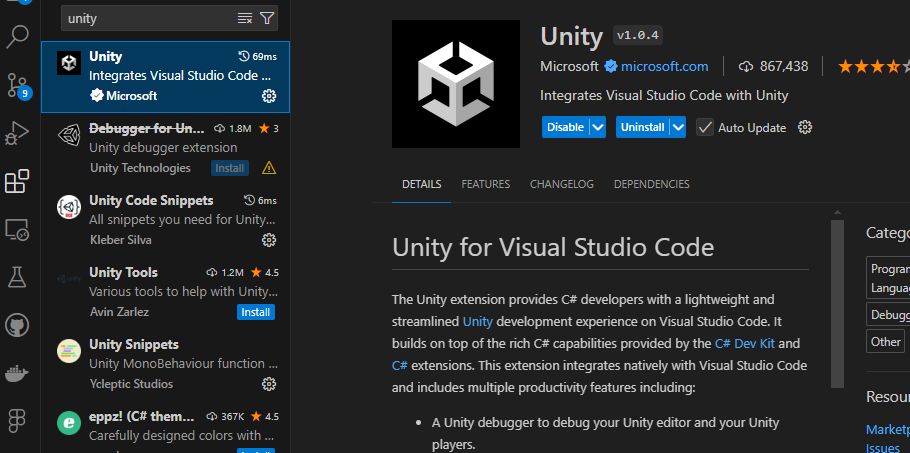
Click Into Extension Icon and search for Unity and install this extension.

Now go the Edit >> Preference >> External Tools


Select Visual Studio Code 


Then Go to Assets >> Open C# Project To Open the VS Code with Unity Project.

You can install other unity extensions you like. but to keep it simple just Unity Extension from Microsoft is all you need to setup the VS Code with Unity.

### Create Your Custom Script
Select Your Game Object From hierarchy And In Inspector Add Component then Select New Script Option and Give Your Script Name and press Create and Add Button. it will create our Custom Component C# Script File into Asset Folder and Add it into our Game Object.


we can also create our components from context menu in asset window. 

then we can drag our file to selected game object inspector window to add the component.

### MonoBehavior
when we create custom components by writing c# scripts every script must extend a MonoBehavior class. like this
```C#
public class GameManager : MonoBehaviour
{
    
}
```
**MonoBehavior** has life import like cycles which can be used to handle our game logics. following are the important methods
- Awake()
  - this method is called first time when our object is loaded in the game.
  - it is only called once when loaded
- Start()
  - it called right after the OnAwake and first frame of Update method
  - it is only called once on a object
- Update()
  - this method is called once per frame
  - commonly use this to take user input and move objects etc.
- FixedUpdate()
  - Called at a fixed interval, independent of the frame rate.
  - This method is called on our fixed value what we set in Time Settings by default it is 0.02 == 50 times per second. so it is called 50 times per minutes
  - and it is mostly used for physics base calculation. our all the physics components which we add in a scene like RigidBody do it's calculation inside this method.
  - this function called the cost performance so settings it's value in Time settings in Fixed Timestep property lower the value higher the calls results heavy performance higher the value results less calls and less performance usage. just remember 0.02 == 50 calls.
  - we can use this method to do our own physics calculation as well like adding force of our kick in a football.
- LateUpdate()
  - This is called once per frame after all the update method calls in a scene.
  - we can use it to follow up updates, such as camera movements updates right after the player movements.
- OnEnabled()
  - this method is called once when we enable our game object.  that a property we can change in inspector to disable and enable a scene. inside red circle.
  - these methods are only triggered when you are running the game.
  - we can enable object from our code in game. 
  - for test purpose we can run game and enable disable from inspector to test it.
- OnDisabled()
  - this method is called once when we disable our game object.
- OnDestroy()
  - this method is called once when we destroy our game object.


**Key Notes**
- Suppose we have 100 objects in a game when we call this any of the above method. that method take up it's load and performance and once all the 100 objects method are called then it moves to next method like all method loaded and called Awake method until all awake process method is done Update and Start does't get triggered. once Awake done we have first frame of Update method and as well Start then base on our fixedstep value our Fixed method is called. talk about our late update method it's called per frame but right after our Update method complete it's all process. 

### Time Settings

- **Fixed Timestep**
  - as we discuss before in fixed update method this values is for invoking FixedUpdate method per frame by default it's 0.02 == (50 times per frame)
  - suppose your first scene is a menu where you have no game objects just user interface. pressing few buttons etc. so setting this value to 1 then it will be called only once per frame and reduce the unusual load on our CPU.
- **Maximum Allowed Timestep**
  - This setting limits how much time can accumulate before the physics engine updates.
  - It prevents the physics simulation from running too many updates in a single frame if the game lags.
  - if our physics calculation are suppose to take 0.5 seconds and our maximum allowed timestep is 0.333 means it has cross the threshold limit we have set for a frame to process so it will pause the physics engine and continue it from the next frame. to maintain our game fps and performance.
  - if our fixed timestep value is set to 0.01 means 100 times fixed updates will get called and if these updates takes up our 0.016 (60 frames) that good but if it takes more time like 0.5 it our will pause and continue from our next frame. to avoid taking more time and performance.
  - if we want our game to maintain 60 fps we can set it to 0.016 value. but we might compromise our physics of the game.
- **Time Sale**
  - it controls our game speed 1 is normal .5 is 50% slower and 0 means it's paused.
- **Maximum Particle Timestep**
  - This setting limits the maximum time step for particle systems.
  - It ensures that particle simulations do not run too many updates in a single frame.
  - similar to physics calculation. it pause the particle and continue in next frame when it cross the threshold.
  
**Notes**
- these values can set adjust in runtime according to our scene. requirements.
- remember maximum fixed timestep and maximum particle timestep can not be lower then fixed time step it can be equal or greater not less then.
  


this example over here mean 100 fixed update calls per 0.01 seconds and they can take up to 0.1 seconds then it will move to next update. and particle can take only 0.02 seconds

<!-- # Chapter 4: Advanced C# Scripting -->

<!-- # Chapter 5: Canvas System - UI -->

<!-- # Chapter 6: Physics -->

<!-- # Chapter 7: Animations and Animator -->

<!-- # Chapter 8: Ragdoll and Inverse Kinematics -->

<!-- # Chapter 10: Audio Setup -->

<!-- # Chapter 11: Navigation Basics -->

<!-- # Chapter 12: Systems Basics -->

<!-- # Chapter 13: Third Party Plugins/Essential Packages -->

# Class 6th Programming fundamentals, understanding structure and Integrating third person start kit with practical work.

### Programming Fundamentals
- **Data:** Just think of that and tell me what comes in your mind? the data can be a person information, name, gender and sect. a data can be your bank balance it could be any piece of information. now to understand the data in programming let's make it more simple we have following data in the programming
  - Integers: integers are numbers where we don't have any number after dot like 10.5. they are simple straight numbers like 1 2 3 4 5 6 they can be in negative or positive
  - Decimals: decimals are the numbers like 10.5, 66.5, a number which has the number after dot.
  - Characters: character or letter is a single any alphabetic letter or any symbol or any number inside single citation  like this example => `'a'` inside this we see `a` but it can be any letter you can see in your keyboard you can put inside these citation and it will be a character.
  - Text: text is the collection of letters. a word, sentence or paragraph. we write the text data inside programming in double citation `"Hello I am a text a piece of information."`  this is `"` double citation you will find this symbol in the keyboard. and we place our text data inside it. and in programming it is mostly known as String data.
  - Condition: a condition is either true or false. let's take an example: am i standing right now?. so it is true or false? if you can see me standing your logical thinking will say true because you see me standing right. and if i am sitting then answer to my question will be false. because i am sitting and i asked that `am i standing right now?`.
- **Variables:** in programming we create variables to store the data. it holds the data we assign it. until our program is closed. or until that variable is in the use of process execution. let's take an example you want to store player name so we created a variable and stored the player name which is a data. right so we can do like this. `playerName = "Syed Suleman Shah"`.
  - a variable can not contain any spaces.
  - a variable can not start with any number.
  - a variable can not contain any special symbol such as 
    - arithmetic symbols: `(+,-,/,*)` addition, subtraction, division, and multiplication.
    - assign symbols: `=, +=, -=, /=, *=` assign, add and assign, subtract and assign, divide and assign, multiply and assign. assign means it store the data into variable.
    - conditional operators: `==, !=, >=, <=, >, <` equal to, not equal to, greater and equal to, less and equal to, greater then, less then.
- **Data Types:** Data Types are the identification of the data that which data it is and what data type will be used for it. and in c# programming we have following data types.
  - **int** => it is a keyword in programming language which represent data type. and int means integers and it is the identification for the integers.
  - **float** => float data type is used for decimal values like 20.5f, 10.5f in c# if it is a float value it will have `f` in the end of the number which identifies it a float value.
  - **double** => double is also identification of decimal values but it doesn't have `f` in the end. and the different between float and double is the range. range after the dot. is larder of numbers like `10.000010111111112312421123` and float has the lesser range.
  - **string** => as we have discussed in the [data](#programming-fundamentals). any text inside double citation `"` is a string type data. 
  - **char** => when you see a single letter inside single citation `'` that means it is character data and it has char as data type.
  - **bool** => bool is a data type keyword and it is known as boolean. a data type which hold conditional data. as we have discussed above in the condition. so it hold either true or false.

### Unity C# Programming Structure

let's see this code example
```c#
using UnityEngine;

public class GameManager : MonoBehaviour
{

}
```
in above code example in first line you see `using UnityEngine;` it's library or package we are using in this class. A library provides us the built in functionality which we use. and as we are learning unity C# this package provides us unity built in functionality. like that `MonoBehavior` which is parent of our current class. `GameManager` in previous class we had understand about custom components so when you create a custom components you give it a name and I have created my own custom component and I call it `GameManager` when you create your own custom component you can name it as you like.

In C# our basic C# code we place all of our logic inside a class so we write like
```c#
public class YourClassName
{ // this is opening bracket

} // and this is closing bracket.
```

look close to above brackets these brackets define the body. of the class now everything inside these brackets are the part of the class. and in above code example you see `:` this  collin symbols this means that this class is inherited from `MonoBehavior` by inheriting all of the functionalities in Mono Behavior comes in our class.

**How we identify a method?**

in c# our a method has 2 types one a void method and 2nd which return some data so we give it data type keyword of the data it suppose to return. we start with access identifier `public, private` which means that this method will only work inside the class or it can be called from other classes as well. so as there names `public` means that it can be access from outside. and `private` means it can be access from only within the class.

```c#
public class YourClassName
{
  public void YourMethodName(){

  }
}
```

now we have a method inside our class and as you can see that method is define between classes opening and closing brackets `{}` and method has also opening and closing brackets `{}`. and if you noticed method has also small brackets after it's name `()` now inside these brackets we pass the parameters *(parameters are the variables we pass inside the method brackets)*  example

```c#
public class YourClassName
{
  public void YourMethodName(string playerName)
  {

  }
}
```

you see we passed a parameters `string playerName` which pass a text data and what is the data? it's our player name. 

**How we understand the variables which pass the data.**

a variable has 3 state in which 
  - we create a variable and initialize it 
  - 2nd we use the variable somewhere. 
  - third we change the value of that variable.

to create a variable first we give it's data type then we write our variable name, and then we can initialize it or end it `;` semi-colin  example

```c#
public class GameManager
{
  // here we have created a variable of integer and we didn't initialize it.
  public int count;
  // here we have created text variable and initialize with the a data of Syed Suleman Shah.
  public string playerName = "Syed Suleman Shah";

  public void Awake()
  {
    // here we have assign it's value to 0
    count = 0; 
  }

  public void Update()
  {
    // here we are increasing our count value by 1. changing it.
    count++;

    // we can also do like this
    count += 1;

    // also like this
    count = count + 2;
  }
}
```

in c# let me tell you there are `global` and `local` variables. global variables are created outside of the method and local variables are created inside of the variables.

like example

```c#
public class GameManager : MonoBehavior
{
  // here is the example of global variable 
  public int counter;

  private void Awake()
  {
    // here is the example of local variable which will be only limited to this method awake.
    int timer;
  }
}
```

----

# Practical Tasks To Perform.

## Task 1: *Import the Starter Kit Third Person Controller.*

### Step 1

[Click Me](https://assetstore.unity.com/packages/essentials/starter-assets-thirdperson-updates-in-new-charactercontroller-pa-196526) to add this unity asset into your library. as we have learned before.

### Step 2
Go To your unity Editor in windows context menu select package manager.

- windows > package manager.
- 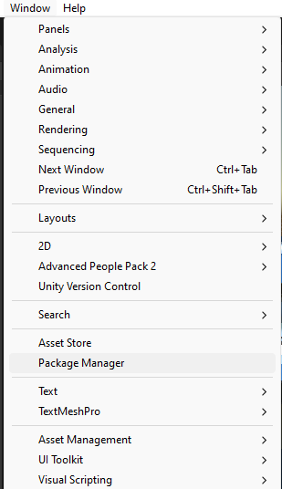

- Inside Package Manager Select Starter Asset - ThirdPerson and download then import into your project.
- 

- if you see this warning press install / upgrade it will install following packages from package manager. 
  - CineMachine
  - new input system

we will study these 2 packages in detail in upcoming classes. for now just follow the steps.
  - 

### Test The Third Person and Enjoy.

- Go To Directory > StarterAssets > ThirdPersonController > Scenes > PlayGround

Open the PlayGround Scene and Enjoy.

### How to use Third Person Prefabs in to Your Scene?
Go To StarterAssets > ThirdPersonController > Prefabs


Select  following prefabs. drag and drop them into your scene.
- MainCamera
  - to add this make sure to delete the other Main Camera Object From the scene first then add this one.
- PlayerArmature
- PlayerFollowCamera

**Now we need to setup our camera to our player.**
Select The Player Follow Camera And Inside The Inspector Menu Check out the component. we need to add Player Camera Target Object into `Follow` and `Look At` property See In the Image Below.


Now Select This `PlayerCameraRoot` Object From PlayerArmature and drag and place it into above properties.


Make Sure Your Main Camera Object Contains the CinemachineBrain Component. Check The Below Image.


**once you follow all these steps our third person controller is setup.**

## Run and Test.

## Congratulation! You Have Added Third Person In Your Project.

## Task 2 Ball Inside Box.
You Need to complete previous task to start this task. in here we are going to create a box and inside box we will add a ball and we will create a trigger point for player to apply force in the ball.

### [Check out the output here](https://youtu.be/aoEB63E-m1c)


## Step: 1 Create A Box.
Design Your Box. see in the image below I have used cube scale it and places it all around to create the box shape.


## Step: 2 Create A Ball

Create a 3D Sphere and add `RigidBody` Component to it. then create a physics material in your asset window.


in physic material we have following properties
- **Dynamic Friction:** The friction coefficient when two objects are moving relative to each other. Lower values make the surfaces more slippery when in motion.

- **Static Friction:** The friction coefficient when two objects are at rest relative to each other. This controls how much force is needed to start moving an object at rest.

- **Bounciness:** A measure of how much an object will bounce back after hitting a surface. Higher values result in more bounce.

- **Friction Combine:** Determines how the friction coefficients of two colliding surfaces are combined. Options are Average, Minimum, Maximum, and Multiply.

- **Bounce Combine:** Similar to Friction Combine, but for bounciness. Options also include Average, Minimum, Maximum, and Multiply.


**Add Physics Material into ball collider**
In `Sphere Collider` component drag and drop the physic material in material property. for the reference see the image below


Put the Ball Inside the Box. when all set. ready to next step

## Step: 3 Create a Trigger Point

**Trigger Visuals:** In Games Visual is important to give the player sign to make him curious and take action towards the visuals. In our scene I have a foot mat.
By Creating an Object with cube and place it. like this


for this appearance I have used this [image here](https://www.myhomedecor.pk/product/door-mat-foot-mat-ftgr18/) download it and add into your assets directory of the project.

then drag and drop it into your material base map property.
like this

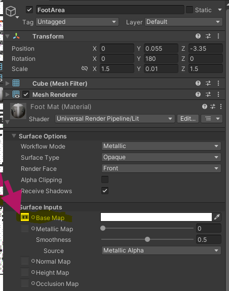

we have set our trigger visuals now let's add a trigger collider where we can detect that player has enter into this foot mat.

In Below Image I have added just a collider and mark true to  Is Trigger Property.


Now To Identify if the player enter this trigger it's invoke an event.

## Step: 4 Custom Component.

let's create a custom component by creating new script make sure you add this script in the object where you have added that collider which will detect user.


let's look into the Code I have created to Identify the user enter.

```C#
using UnityEngine;

public class BallGame : MonoBehaviour
{
  // this over here speed property. 
    public float speed = 10;
    // a force direction variable which will be used to set the direction for the ball where it should move.
    public Vector3 forceDirection;

    // here is the rigidbody component variable. 
    // we will use this to apply force in given direction.
    public Rigidbody ballRb;

// as we now that OnTriggerEnter method only called when another collider go though this isTrigger Collider.
    private void OnTriggerEnter(Collider other)
    {
      // over here we are checking if the object which collide with our trigger collider is player or not. it will work if our player Game Object tag is set to this Player.
        if (other.CompareTag("Player"))
        {
            ballRb.AddForce(forceDirection * speed, ForceMode.Impulse);
        }
    }
}

```

this is how it will look inside the inspector. our custom script. 
- **speed:** here we can set the speed value.
- **force direction** force direction is Vector3 type and it takes 3 parameters X, Y, and Z. if you want the ball only moves upwards make X and Z to 0 and set Y some value.
- **Ball rb** we need to assign our ball RigidBody. where we will apply the force when player enters into our trigger.


Now it suppose to give you [this](https://youtu.be/aoEB63E-m1c) kind of results.

**Play and Test how it works. if your code is working so many congratulations.**

## Task 3: *Coin Picker Game!*

- **Step 1:** Create a New 3D Project Select Universal 3D Template Give Your Project Name, and Select Destination Folder and Create the project.
  - 
- **Step 2:** Go To File > Build Settings > Select Android and Press the Switch Platform Button.
  - 
- **Step 3:** Implement Third Person Controller. As I have guided you in [Task 1](#task-1-import-the-starter-kit-third-person-controller)
- **Step 4:** Open PlayGround Scene From Third Person Controller.
- **Step 5:** Design Your Level as You Like.
- **Step 6:** Test Your Game On Mobile.
  - Go To PlayStore on your phone. And Search for Unity Remote and Install that application.
  - Enable USB Debugging In Your Phone.
    - Go To Settings In Your Phone And Find `build number` in your phone and keep tapping it. to enable to developer mode.
    - once you have enabled developer mode. go to the developer mode and enable use debugging.
    - now connect your phone with the your PC.
    - Once You Connected Your Phone You Will be able to see it in Run Device build settings unity. just like shown in the picture. select it.
      - 
    - Now Go To The Edit > Project Settings > Editor and Select `Any Android` In Unity Remote Option.
      - 
    - Now Open Your Unity Remote Application In Your Phone And Play The Game In The Unity.
- **It's Your Big Achievement if you have Completed this step. Bravo!**
- **Step 7:** Create A Coin GameObject And Make it Prefab.
  - 
- **Step 8:** Make the Coin Pickable
  - Add Box Collider Component In Parent Object And Modify Center and Size As You see it fit.
  - 
  - Make Sure To Enable IsTrigger Option.
  - Now Let's Create Custom Component Script And Name It `CoinPickable`
  - ```c#
    using UnityEngine;

    public class CoinPickable : MonoBehaviour
    {
      // as we know that this method is called when any physical object interact with a collider when it's isTrigger property is enabled.
        private void OnTriggerEnter(Collider other)
        {
          // here `other` is the object which is collided with our coin. and we are comparing it's tag to see if the object is player or not.
            if (other.CompareTag("Player"))
            {
              // console log message to see our player picked the coin.
                Debug.Log("Coin picked up!");
            }

            // destroy our game object once picked up.
            Destroy(gameObject);
        }
    }

    ```

**Great Work You Should be able to achieve like [this](https://www.youtube.com/embed/cQ8x56Ap0jY)**

[](https://www.youtube.com/watch?v=cQ8x56Ap0jY)

## Task 4 Animate Our Coin In Our Coin Maker.
- **Step 1:** Open Our Coin Prefab From Asset Folder.
  - Open Animation Window `Ctrl+6` ShortCut Key
  - Select Our Coin Object Which We Want to Rotate To Create Animation.
  - In Animation Window Press `Create` Button To Create Animation Select Your Directory Where You Want to Save Your Animation.
  - **Verify That Our Animation Is Created**
    - Select Our Coin Object And In Inspector Window You will see Animator Component like in the image below.
      - 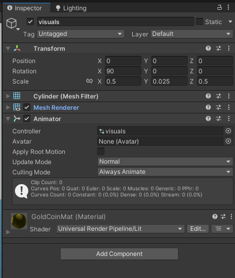
  - **Animate Your Coin:**
    - Red Button in the animation window when you enable it. it start recording the animation. on the duration you have select. what ever you made changes in the game object components. you change position or scale or rotation or you have done any changes in any component. it will record that change in the keyframe 
    - you create your own animation for the coin. you can increase and reduce scaling or rotation the object on Y-axis like I did.
    - In The Below Image I have created two keyframes one at the start and one at the end. and in those 2 keys frame i am just changing Y value. you can try next step with scaling.
    - 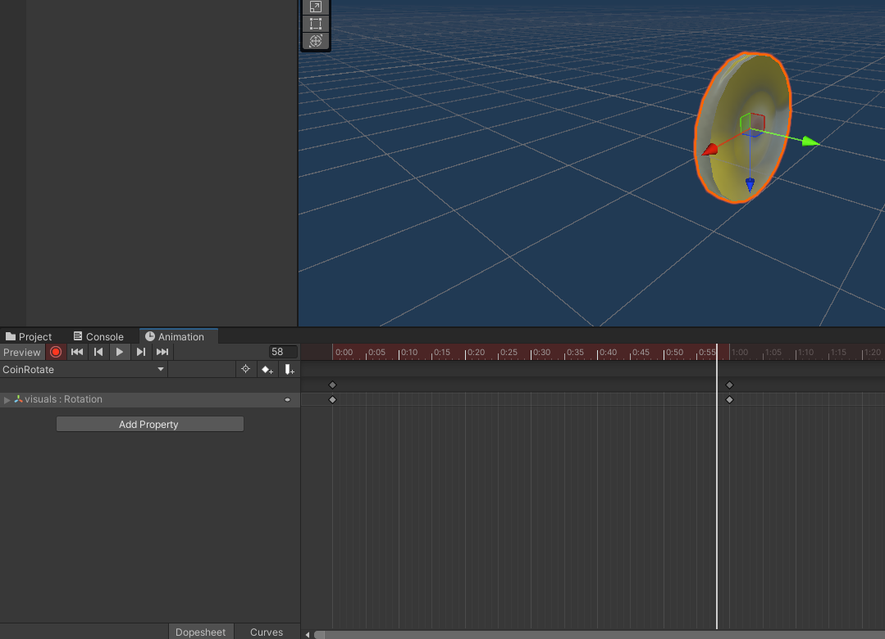
  - Exit From The Prefab Hierarchy By Pressing Back Arrow At the left corner.
  - 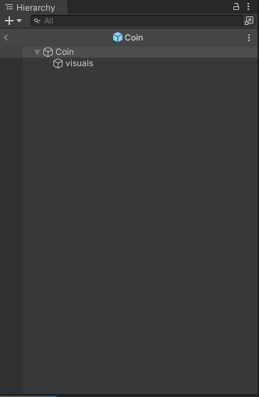
  - Now You are in the scene Hierarchy
  - 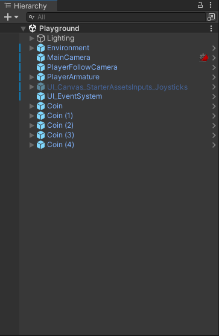
  - **Play The Game And Share the Results In the Group.**
- **Fantastic You Have learned and did a practical on animation. now you suppose to be understanding more about animation and adding stuff together to create our game functional.**
- Before You Just studied theoretical concepts about these and did example separately now you have used these concepts and created a small scene. where our player is picking the coins. and coin also showing a animation which gives us alive feeling in the game.

## Task 5 Deploy Game Into Your Phone.
  - **Step 1:** One of the above task I have taught you How to connect your phone with the unity editor. follow that step and connect your phone with your unity.
    - go the build settings to verify in run device.
    - 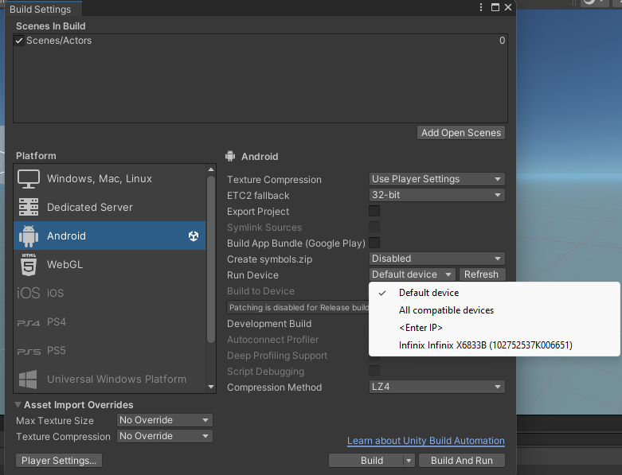
  - **Step 2:** Let's understand the build settings first.
    - Go The Project Settings > Player
      - here you can Give Your Project Name, Organization / company name and version.
      - You can add your game logo here. size should be from 200x200 to 600x600 pick any sizes in these range.
      - 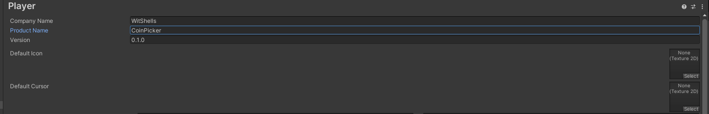
    - In Resolution and Presentation.
      - leave the other settings as default we will understand the important one.
      - **Orientation** how our apps open, in landscape or in portrait. base on the game you can set this in the settings. now according to our game I would like to set it in landscape 
        - default rotation set to auto rotation and 2nd auto rotation behavior to user.
        - now the only rotation i want to allow in landscape Right or left. however user feels the comfortable.
        - 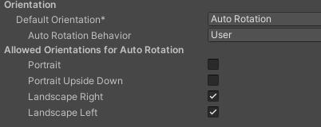
    - In Other Settings
      - there are a lot of settings leave most of them default just understand the important one.
      - first texture compression.
      - 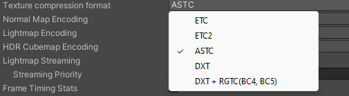
        - texture compression format. 
          - compression: to reduce some size or quality. for the performance. we use different compression methods.
          - ETC, ETC2, ASTC, DXT, DXT+ RGTC(BC4, BC5) 
          - these all are compression formats. I will use here ASTC because it's low the texture size which also effect some quality of the texture but in mobile it's hard to notice that quality.
          - let's just set it ASTC.
    - In Other Settings Under Configuration
      - 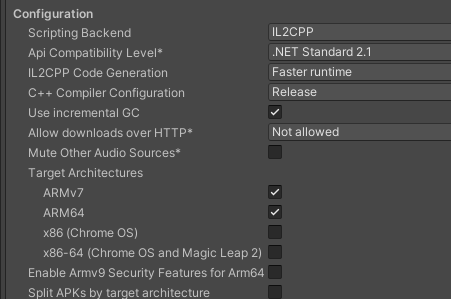
        - **Scripting Backend:** IL2CPP and Mono we have to scripting configuration for android device we mostly need ARM64 which comes under the IL2CPP so set it's value to IL2CPP.
        - **ARM64:** enable this. as i said above we need this enabled for android devices.
    - **identification Settings** this one is important.
      - package name. you can write your own here or it will pick from your company and project name
      - package name is required and every running app has there package name. and when we publish our app. this package name is also required in the settings on the play-store. 
      - Minimum API Level. it will build your apk to support phones who has at least android version you have selected.
        - if you don't know about android versions. you can go into about phone and check your android version. if your android version is lower then what is in the unity minimum api level then you might need to upgrade your phone.
      - Target API Level. by default it is set to automatic but if you want to target a specific android version you can select here.
      - 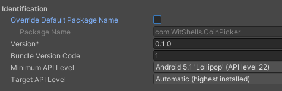
  - let's understand about the build settings 
  - 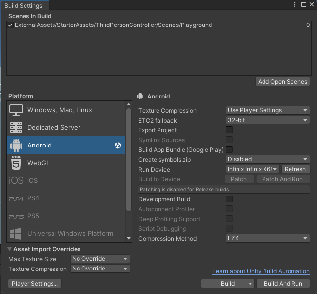
    - in this build settings window on the top you will see `Scenes In Build` in here we add the scenes we want to build. if you press the `add open scenes` it will add currently active scene into scenes in build. you can also drag and drop your scene in here.
    - scenes here are stored in indexed which start from 0 and number increases as we add more. and unity will open the first scene which will be at index 0. by default and then we can change the scene. from our code which we will cover while developing this game.
  - **Add Android Controls from starter third person asset:** before we build the game. we will need the controls for the android. so we will use prefab given in starter third person asset.
  - Go to StarterAssets > Mobile > Prefabs > CanvasInputs
  - select your prefab and add it into your scene. if you using `Playground` scene from this asset you should have this in your scene hierarchy select it and enable the Game Object.
  - 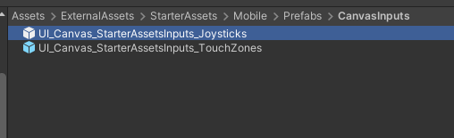
 
  Cool So here we understood the project settings. now we are ready to build our apk.

  - make sure you have select new input system  in project other settings. it can not be both for android. 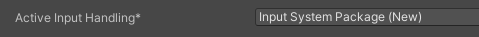

  go to your build settings and make sure your phone is connected. and press `Build And Run` if your project contains no errors it will start build and install the apk in your phone.
  you can press just `build` it will build and apk into your selected directory.
  I prefer to create a new build folder into project directory and build my project file into build directory or folder.
  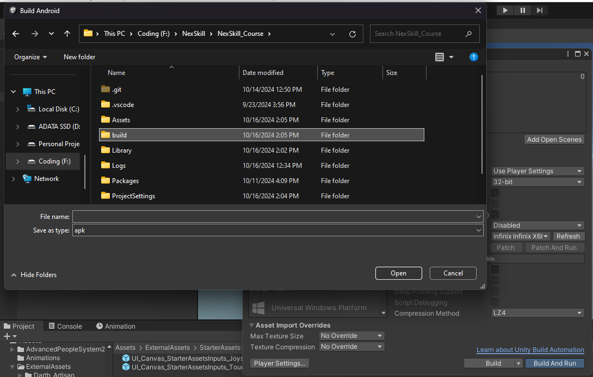

**After Completing the following steps you should be able to run your game into your phone.**
**Share Your ScreenShots In the whatsapp group.**

# Task 6: Game UI UX Design, Menus Scene Management.
- **What is UI and UX?** 
  - UI means User Interface, The visuals you present in the screen is the UI. how it looks and how it is structured.
  - UX means User Experience, How user interact with each option. is the UX easy to understand. easy to adapt and easy to use.
- **Game Menus**
  - Have you ever notice why menus of the games are so smooth? why they take no navigate from one page to another smoothly. unlike game. which runs in a 3D or 2D space. game user interface runs in a canvas. which render only when it is updated by hand. example from a main menu where you have list of option (play, settings, quit) and player press settings and page is changed to settings. it's only updated when it's required unlike 2d, 3d space they frequently updates in milliseconds.
  - let's create a menu scene in which we have following options.
    - we ask player to enter his name in a `InputField`.
    - we add button to start the game by pressing `Start` button.
- **Step 1:** Understand and Create Canvas.
  - right click on the asset window and create a new scene and name it Menu.
  - in menu we don't need any lights or camera. unless we are doing some 3D work in our menu scene. in my case i won't be doing any 3D work it will be simple menu so I will delete the camera and directional lights in the object. but before deleting I want to tell you one important thing. camera has a component which listen to the audio. if you remove the camera you won't listen and sfx (sound effect) if you add for button sounds etc. so if you have any sound effect you can create an empty game object and add component `Audio Listeners` into it. Audio Listener is you ears from which you listen the audio. in your game world. or menus.
  - Now let's Create A Canvas. right click in the hierarchy go to UI > Canvas. Create `Canvas` in your scene. now in your scene their are 2 game objects created. one canvas and other `EventSystem`
    - 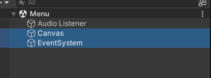
  - **Canvas:**
    - Select the canvas game object and see it's inspector components
      - 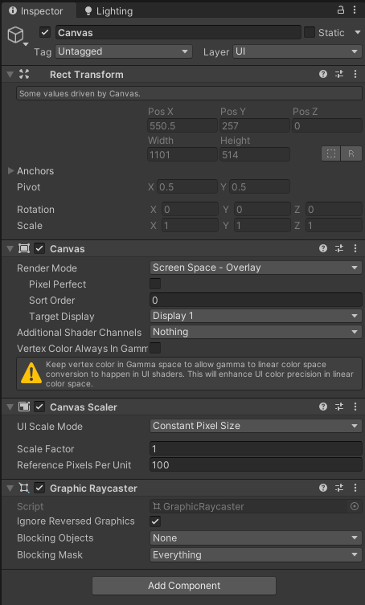
      - in normal game object we have transform but in canvas we have Rect Transform. because transform works in 2d or 3D environment where our rect transform works on our screens. every UI game object will be created inside this canvas. to make them work all the objects must be created inside the canvas. Canvas will be parent of all UI object only then they can work as we want them to work.
      - we have the following components and I am doing to discuss each of them in detail.
      - Canvas Component
        - Render mode types.
          - 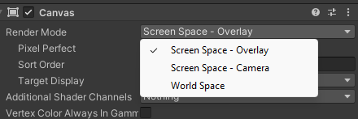
            - Screen Space - Overlay
              - it is rendered on our screen. 
            - Screen Space - Camera
              - it is rendered in front of the camera.
            - Word Space
              - it is rendered in 3D world space.
          - note: if you use Screen Space you won't need camera but for other two types. camera is must be added in the scene.
          - for our scene we will stick with Screen Space - Overlay (Overlay means on top of)
        - Leave the reset options as in default. but to avoid the warning in Vertex Color Always In Gamma Mark it True.
      - Canvas Scaler.
        - UI Scale Mode. it types define how UI is scaled on the screen.
          - Constant Pixel Size: 
            - The UI elements maintain a constant pixel size regardless of screen size. This is best for fixed-size UIs.
          - Scale with Screen Size: 
            - The UI elements scale proportionally with the screen size. This is ideal for responsive UIs that adjust to different resolutions.
          - Constant Physical Size: 
            - The UI elements maintain a constant physical size, irrespective of the screen’s pixel density. This is used for UIs that need to stay the same physical size across different devices.
        - My favorite is Scale with Screen size. because it's adaptable to any mobile screen. and we are going to use it in our game. so select the Scale with Screen Size.
        - with each type you get different types of parameters below it. 
        - 
          - Reference Resolution: here we can define our width and height of the resolution. let's make it 720p 1280 width and 720 height.
          - Select Screen Match Mode to Expend For Now. You can Try different as you like and test the output how it looks.
      - Graphic Raycaster.
        - it is the canvas component which helps to interact with the UI component. if you remove it you won't be able to press any buttons and write to any input fields.
        - it won't be needed to UI pages which has just information to show.
    - here we discuss in detail about the canvas game object. I hope you understand everything. if not drop the question in the group. and here is the final canvas inspector view.
    - 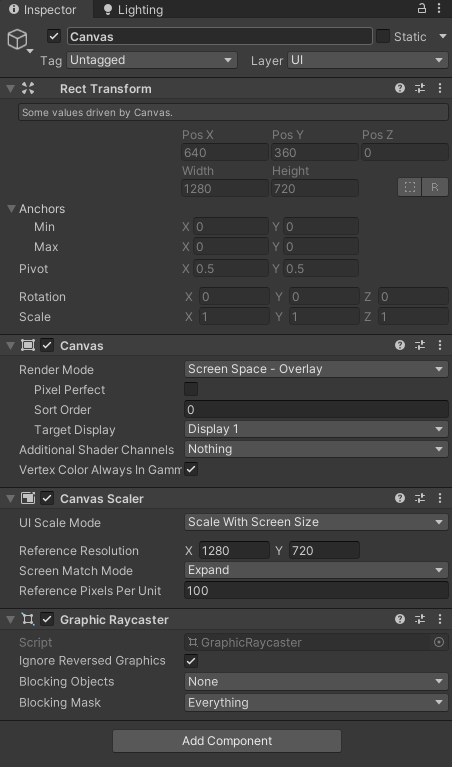 
    - we might need this canvas settings in other scenes as well. so I am going to create it's prefab.
    - Drag and Drop the Canvas Game Object into your prefab folder.
  - **All Common Components We Can Create for UI**
    - 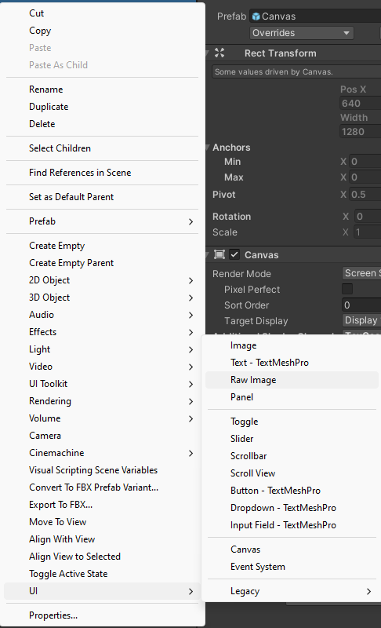
    - **Canvas Renderer** component and it is required with all UI component which are going to be visually visible in Canvas.
    - **Image** this component support sprites and we can use the image component to create some cool UI designs as well like, health bar, timer, progress bar. and a lot and it's only take an sprite when you add an png file into your assets that's not an sprite by default.
      - 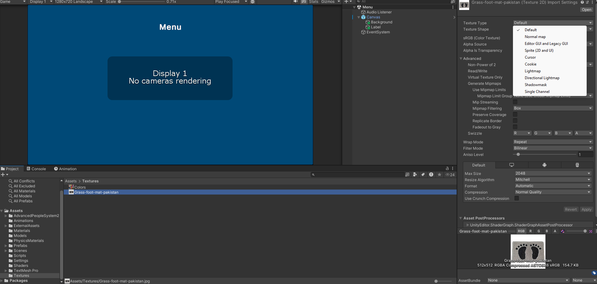 
        - select any image in you asset window and check the inspector window.
        - in the first property name texture type look into it. you will see multiple options. by default it has default type but if we want to use that image inside our Image component we need to set the type as sprite.
      - Raycast target mean that can we click it or not.
      - *Raycast Padding* by default all of the area of our object in intractable we can set some padding. from left, right top and down to reduce the area. to click.
      - we will understand other parameters in the flow.
      - for now leave the settings as it is. and just change the background color which you like for you menu.
      - 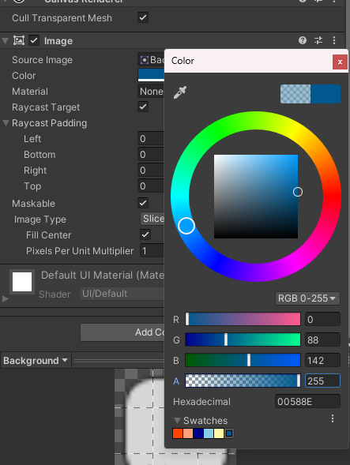
        - make sure alpha value is full 255
    - **Text-TextMeshPro** Text Mesh Pro is Rich Text UI provide by unity. you can customized fonts, change text alignment, we can adjust font size, and style. create one object and test the properties by changing them all.
    - **Raw Image** you can use this component. to add any image format. png or jpg but preferred jpg. and it has less features then image component. and very much useful if you just want to place fixed images.
    - **TextMeshPro-InputField** This Component use to take input from the user. and it has many properties such as which type of input we want to take? is it a number or a text or a decimal. how many characters we can enter 10 characters or 500 characters. is this InputField is for password? then it should be visible or invisible. a input field contain 2 children both Text Component Game Object one used for hint, and other used for the value. user going to enter.
    - **Toggle** toggle component provide us a checkbox which we can use to get condition true or false. let's say if we are asking is Are You Male? and give him a checkbox. if user is a male he will tick it to make it true or un-tick it to make it false.
    - **Slider** slider component in UI can be used for volume. and also we can use it to create health bar or progress bar. it has a minimum value and a maximum value and as we move the slider from left to right values increases if we move the slider from right to left the value is decreased.
    - **Button** we all know what is a button right. we press it to execute an event. in the following image reference. there is on OnClick Event listeners we register our events in here. so when button is clicked those events are triggered. 
      - button contain a single child a Text component. where we can write button name. let's say a `Start` button or a `Quit` button.
      - 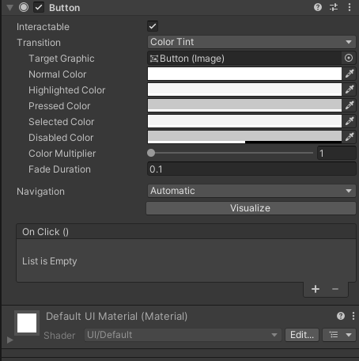
  - overview is enough for necessary components we can add inside our canvas. now design your Menu as you like. 
  - **EventSystem** EventSystem is required component for canvas if we want to interact with canvas like pressing button. giving values in input fields. etc
    - by default EventSystem use old Input System for interaction if you have new input system installed. a error would be appearing in the inspector like in image below saying `Replace with InputSystemUIInputModule` press that button and it will replace it with new input system.
    - 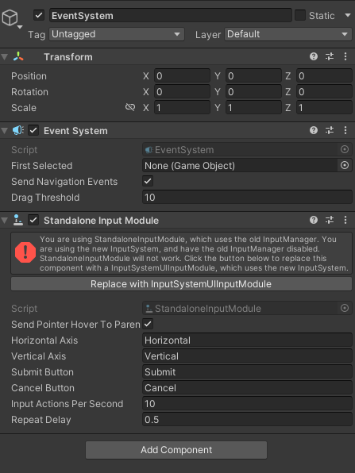
  - **Common Events in UI components.**
    - UI components has common events for the interaction with Mouse or Touch On Mobiles.
      - **OnHoverEnter** it's triggered via mouse when we are moving mouse on top of that component so as our mouse get close. it trigger the event OnHover.
      - **OnHoverExit** when we move mouse away from the component.
      - **OnPressDown** when we click and holding down the button of our mouse or touch. we haven't released the button yet.
      - **OnPressUp** when we release our button hold. this event get triggered.
      - **Note** hover doesn't work on touch just with mouse device.
  - Design Your Menu Scene. Here is Mine.
  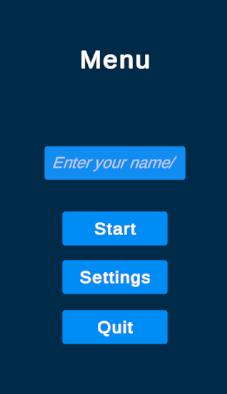
----
# Class Summaries

## class summary 27-09-2024 Friday

In Class we learned about unity editor Scene and created a scene 
while creating the scene we understand 

- Prefabs
- How To Look as an Object perspective while designing.
- How we identify Object X,Y,Z
- Global and Local Locations
- Pivot Point and Center Point
- Keeping Proportion and accurate space between objects while designing. using snap grid tool in unity
- Mesh Filter Component
  - we learned that it render the 3D mesh of an object
- Mesh Renderer
  - we learned that it is used. how it appears and act in our scene. does lights shadows can be cast on light? and Materials to add in this component for mesh visual presentation.

After Class I have designed an complete Level Here [Click Me](https://youtu.be/VM36TQJrkqw) Just by following it up you can clear your concepts More!


---
## class summary on 30/9/2024 Monday
- we understood what are the light mode and we see the example
- we studied all type of light objects in Directional, Spot, Point and we see their examples as well. we understood the light component
- we understood how we bake the light.
- we see the example of mix, bake and realtime lights
- we created a small scene revise the previous section.


## Class summary on 2/10/2024 Wednesday
- practical work.

## class summary on 4/10/2024 Friday 
- we studied about unity components 
- we discuss in depth about collider with practical example 
- we understand how Rigidbody component works and physics forces.
- we understand animator component overview the animator controller and created a fan animation clip.


## class summary on 7/10/2024 Monday
- we understand console and types of logs
- we understand MonoBehavior and it's life cycles 
  - Update
  - FixedUpdate
  - LateUpdate
  - Awake
  - Start
  - OnDestroy
  - OnDisabled
  - OnEnabled

## class summary on 9/10/2024 Wednesday
- we discussed fundamentals of programming.
  - data
  - variable
  - data types in c#
  - conditional statements
  - loops
- we learned how we can read and understand the code.
- we understood about collider events OnTriggerEnter and OnTriggerExit
- we written this code 

```c#
using System.Collections;
using System.Collections.Generic;
using UnityEngine;

public class AutomaticDoor : MonoBehaviour
{
    public GameObject leftDoor;
    public GameObject rightDoor;

    public Animator animator;

    // public float leftDoorClosingX;
    // public float rightDoorClosingX;
    // public float leftDoorOpeningX;
    // public float rightDoorOpeningX;

    // public float doorMovingTime;

    // private Vector3 leftDPos;
    // private Vector3 rightDPos;

    private bool IsNearDoor;

    private void Start()
    {
        // leftDPos = leftDoor.transform.localPosition;
        // rightDPos = rightDoor.transform.localPosition;

        animator.SetBool("IsNearTheDoor", false);
    }

    private void Update()
    {
        // if (IsNearDoor)
        // {
        //     leftDPos.x = leftDoorOpeningX;
        //     rightDPos.x = rightDoorOpeningX;
        //     leftDoor.transform.localPosition = Vector3.Lerp(leftDoor.transform.localPosition, leftDPos, Time.time / doorMovingTime);
        //     rightDoor.transform.localPosition = Vector3.Lerp(rightDoor.transform.localPosition, rightDPos, Time.time / doorMovingTime);
        // }
        // else
        // {
        //     leftDPos.x = leftDoorClosingX;
        //     rightDPos.x = rightDoorClosingX;
        //     leftDoor.transform.localPosition = Vector3.Lerp(leftDoor.transform.localPosition, leftDPos, Time.time / doorMovingTime);
        //     rightDoor.transform.localPosition = Vector3.Lerp(rightDoor.transform.localPosition, rightDPos, Time.time / doorMovingTime);
        // }
    }

    private void OnTriggerEnter(Collider collider)
    {
        if (collider.tag.Equals("Player"))
        {
            Debug.Log("Player is near the door!");
            IsNearDoor = true;
            animator.SetBool("IsNearTheDoor", IsNearDoor);
        }
    }

    private void OnTriggerExit(Collider collider)
    {
        if (collider.tag.Equals("Player"))
        {
            Debug.Log("Player is far from the door!");
            IsNearDoor = false;
            animator.SetBool("IsNearTheDoor", IsNearDoor);
        }
    }
}

```

## class summary on 14/10/2024 Monday
Practical Tasks

## class summary on 16/10/2024 Wednesday
we discussed about player settings, build settings and deployed our application into mobile.
task 4 and 5th we worked on.
